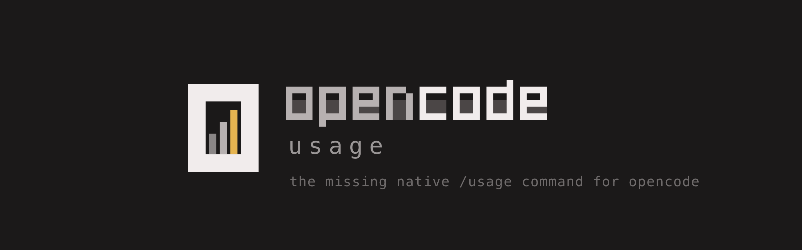
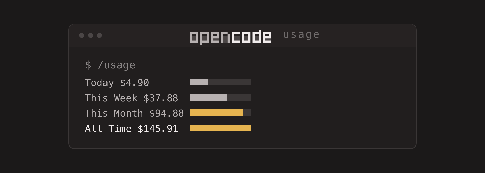

<p align="center">
  
</p>

<p align="center">
  
</p>

<p align="center">
  <a href="LICENSE"></a>
  
</p>

A tiny [OpenCode](https://opencode.ai) plugin that adds a `/usage` slash command.
It reads OpenCode's own local SQLite database and shows your token + cost usage
for **today / this week / this month / all-time**, plus a per-model breakdown, in
a dialog.

```
OpenCode Usage  ·  1,205 messages  ·  114.54M tokens  ·  $145.91 all-time
generated 2026-01-15 14:32

              MSGS    INPUT   OUTPUT     CACHE      COST
Today           41   192.4K    33.5K     3.76M     $4.90
This Week      299    1.37M   233.9K    26.53M    $37.88
This Month     768    3.49M   583.7K    68.10M    $94.88
All Time     1,205    5.50M   925.6K   108.11M   $145.91

MODELS
                              MSGS   INPUT   OUTPUT    CACHE     COST
anthropic/claude-sonnet-4-5    715   3.26M   552.1K   64.75M   $85.77
openai/gpt-5                   490   2.24M   373.4K   43.37M   $60.13
```

## Install

### Option 1: one-line installer

```sh
curl -fsSL https://raw.githubusercontent.com/anxkhn/opencode-usage/main/install.sh | bash
```

### Option 2: let OpenCode install it

Paste this into OpenCode and let the agent do it:

```
Install the opencode-usage tool by reading and following
https://raw.githubusercontent.com/anxkhn/opencode-usage/main/INSTALL.md
```

### Option 3: manual

```sh
git clone https://github.com/anxkhn/opencode-usage
cd opencode-usage
cp usage.mjs        ~/.config/opencode/usage.mjs
cp usage-plugin.ts  ~/.config/opencode/usage-plugin.ts
chmod +x ~/.config/opencode/usage.mjs
```

Then declare the plugin in `~/.config/opencode/tui.json` (this is required:
TUI plugins are **not** auto-discovered from a directory). Create the file, or
add the entry to your existing `plugin` array:

```json
{
  "$schema": "https://opencode.ai/tui.json",
  "plugin": ["./usage-plugin.ts"]
}
```

Fully quit and reopen OpenCode so it loads the plugin. OpenCode auto-installs the
small `@opencode-ai/plugin` dependency on startup.

## Use it

In the OpenCode TUI, type:

```
/usage        # also available as /cost or /tokens
```

A dialog pops up with today / this week / this month / all-time and your
per-model breakdown. Press `enter` or `esc` to dismiss it.

### Optional terminal CLI

`usage.mjs` also runs standalone if you ever want it outside the TUI:

```sh
node ~/.config/opencode/usage.mjs            # full overview + recent days
node ~/.config/opencode/usage.mjs today      # one window
node ~/.config/opencode/usage.mjs week
node ~/.config/opencode/usage.mjs month
node ~/.config/opencode/usage.mjs all
node ~/.config/opencode/usage.mjs daily      # per-day table (last 30 days)
node ~/.config/opencode/usage.mjs models     # per-model breakdown
```

## How it works

```
usage.mjs            engine + CLI (reads the DB, aggregates, formats)
usage-plugin.ts      TUI plugin: registers the /usage slash command
tui.json             declares the plugin so the TUI loads it
test/plugin.test.mjs verifies registration + rendering with a mock host
```

OpenCode's TUI only loads plugins listed in `tui.json`, so the installer adds
`./usage-plugin.ts` there (dropping a file in `plugin/` is not enough for a TUI
plugin). Every assistant message OpenCode stores carries its own `cost` and
`tokens` (input, output, reasoning, cache read/write) plus a timestamp.
`usage.mjs` reads those rows read-only, drops messages that did no billable work,
buckets the rest by local day/week/month, and prints aligned totals. `OUTPUT`
folds in reasoning tokens; `CACHE` is cache read + write. The reader prefers
`bun:sqlite` (OpenCode's runtime) and falls back to `node:sqlite`, so the CLI
also works under plain Node 22+.

### Non-default data location

The database path is resolved the way OpenCode resolves it. Override it if your
data lives elsewhere:

- `OPENCODE_DB` — full path to `opencode.db`
- `OPENCODE_DATA_DIR` or `XDG_DATA_HOME` — the OpenCode data directory

## Test

```sh
node test/plugin.test.mjs
```

## Uninstall

```sh
rm -f ~/.config/opencode/usage.mjs ~/.config/opencode/usage-plugin.ts
```

Then remove the `"./usage-plugin.ts"` entry from `~/.config/opencode/tui.json`.

## License

[GPL-3.0](LICENSE)
